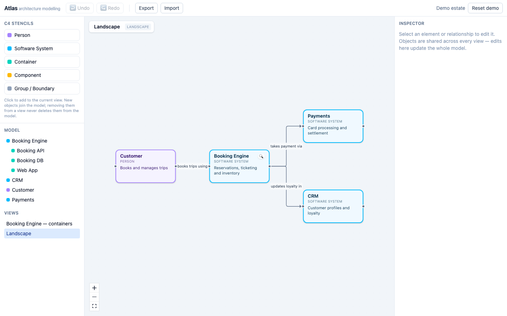

# Atlas

A browser-based, **model-first C4 architecture modelling tool** — not a drawing tool.
Elements exist once in a shared model; diagrams are projections of it. Edit an element
anywhere and every view that shows it updates. The whole workspace serialises to
deterministic, git-friendly JSON — one file per object, byte-stable across round trips.

**Live app**: https://atlas-modelling.pages.dev (GitHub sign-in) ·
[REST API](https://atlas-modelling.pages.dev/api/v1/openapi.json) ·
[Swagger UI](https://atlas-modelling.pages.dev/api/docs) ·
[User guide](docs/user-guide.md)



*The landscape view: palette, model tree, canvas with drill affordances, inspector.*

## Features

**Modelling**
- The five C4 element kinds — person, software system, container, component, group —
  with containment rules enforced everywhere (UI, AI, API, CLI): a component can never
  sit directly under a system, people only appear at context level, and error messages
  say exactly which rule you hit.
- Five view kinds (landscape, context, container, component, custom) with per-level
  placement rules. Double-click to drill down; breadcrumbs to climb back out.
- **Stencil packs**: C4 core, generic tech, business, AWS/Azure/GCP (component-level
  cloud services), and a default-enabled **AI Agents pack** — agents, orchestrators,
  model gateways, MCP servers and sandboxes as containers; tools, vector/episodic
  memory, guardrails, evaluators, human-approval gates and prompt templates as
  components. Each stencil carries a typed attribute schema (model, provider, autonomy
  level…), validated on every write path.

**Canvas**
- 16 connection ports per box (5 top, 5 bottom, 3 per side); aligned boxes get
  dead-straight connectors automatically, and lines can be pinned to exact ports.
- Alignment guides while dragging, resize handles, drag-into-group re-parenting with a
  live drop highlight, box and line colours, a pannable minimap, and one-click ELK
  auto-layout — all undoable.
- **Isometric mode** per view: the same coordinates projected 2:1, labels painted onto
  the box faces.

**Time and money**
- **Temporal modelling**: validity dates, named states ("Current", "Target 2028"),
  per-state attribute overrides, a timeline scrubber, and a diff overlay + report
  between any two points.
- **TCO**: cost entries on any element (recurring or amortised one-off, categories,
  confidence, temporal scope), rolled up through containment with no double counting.
  Analysis drawer shows the estate table with a 1/3/5/10-year horizon and CSV export;
  the canvas can badge boxes by cost; the timeline shows the live run-rate and the
  diff report prices the delta between states.

**Understanding the estate**
- Analysis drawer: model lint, dependency matrix, impact analysis.
- Connections view: an automated ego-network diagram around any element with
  depth/direction/tag filters.
- **⌘K command palette**: fuzzy-find any element or view; select it, jump to it, or
  place it on the current view.

**AI assistant**
- Chat with an Anthropic-powered assistant that reads the model and queues changes —
  create, update, connect, place, set costs and temporal state, delete with cascade
  warnings. Every proposal is reviewed with Apply/Discard and lands as a single undo
  step. Same validation as every other write path.

**Working together**
- Browser-local workspaces, or a **shared database mode** backed by Supabase with
  GitHub SSO and an allow-list — API writes appear in open sessions within seconds.
- A token-secured **REST API** (OpenAPI 3.1, Swagger UI) covering full CRUD, raw
  command batches, lint, ego networks, per-view export, and a machine-readable
  command schema — built for scripts and AI agents alike. See [docs/api.md](docs/api.md).
- Export: workspace bundle (JSON), SVG/PNG, Mermaid C4, PlantUML C4. Import: Atlas
  bundles, Structurizr JSON, ArchiMate Open Exchange (best effort,
  [notes](docs/interop.md)). Round trips are proven lossless by test.
- Everything travels through one command bus with exact-inverse undo/redo — UI, AI,
  API and CLI changes are all equally undoable.

## Quick start

Open [atlas-modelling.pages.dev](https://atlas-modelling.pages.dev) and sign in with
GitHub. Then:

1. **Start from the demo.** Atlas seeds a small airline estate on first run — a
   Customer, a Booking Engine, Payments, CRM and a retiring Legacy Mainframe. (Broke
   it? **Reset demo** in the toolbar restores it; **? Guide** opens the in-app tour.)
2. **Add a system.** On the landscape view, click **Software System** in the palette's
   Context section and name it `Crew Rostering`. Drag it around — pink guides snap it
   into line with its neighbours, and aligned boxes get straight connectors.
3. **Connect it.** Hover a box to reveal its connection ports and drag from one box's
   port to another's. Name the relationship with a verb phrase — `reads schedules from`.
4. **Drill in.** Double-click `Crew Rostering` to open its container view, then add a
   **Container** named `Roster API`. It's automatically parented under the system —
   the model tree on the left shows the hierarchy.
5. **Try an AI agent.** Still on the container view, place an **AI Agent** from the
   palette (indigo stencils) and fill in its attributes in the Inspector — model,
   provider, autonomy level. Tools and guardrails live one level down, on component
   views.
6. **Attach a cost.** Select `Roster API`, expand **Costs** in the Inspector, click
   **+ Add cost** and enter a label and `42000` per year. Open **Analysis** in the
   toolbar — the TCO section shows it rolled up into `Crew Rostering`.
7. **Model its future.** In the bottom Time bar, create a state named `Target 2028`,
   then use the Inspector's **Time** section to set what exists when. Scrub the
   timeline and watch the canvas and run-rate change; the diff report prices the move.
8. **Find anything.** Press **⌘K** (Ctrl+K) and type a few letters of any element or
   view name — Enter jumps to it.
9. **Ask the assistant.** Open **AI chat** in the right sidebar and try *"add a
   payments service with a queue between it and crew rostering"* — review the proposal
   and click Apply. One ⌘Z takes the whole thing back out.
10. **Take it with you.** **Export ▾ → Workspace bundle** downloads the model as JSON
    you can commit to git and re-import anywhere — the re-export is byte-identical.

The [user guide](docs/user-guide.md) covers every feature in depth; the same guide is
condensed inside the app under **? Guide**.


*Drilled into a system: breadcrumbs, containers, and the inspector editing a shared model object.*

## Repository layout

- `packages/core` — `@atlas/core`: metamodel, command bus (undo/redo), JSON Schemas,
  deterministic serialiser, temporal engine, TCO engine, graph analysis, stencil
  registry, Mermaid/PlantUML/SVG exporters. Zero UI dependencies.
- `packages/stencils` — `@atlas/stencils`: built-in packs (C4 core, generic tech,
  business, AWS/Azure/GCP, AI Agents).
- `packages/ai` — `@atlas/ai`: Anthropic tool-use turns mapped 1:1 onto the command bus.
- `packages/cli` — `@atlas/cli`: `atlas validate | diff | export` for CI.
- `packages/storage-supabase` — `@atlas/storage-supabase`: normalised schema + RLS,
  row mapping, atomic optimistic-concurrency saves.
- `apps/web` — `@atlas/web`: React + Vite app, plus the Cloudflare Pages Functions
  serving the REST API and AI proxy.
- `docs/` — [user guide](docs/user-guide.md), [API guide](docs/api.md),
  [ADRs](docs/adr/), [file format](docs/format/workspace-format.md),
  [stencil format](docs/stencil-format.md),
  [AI-agents pack research](docs/research-ai-agents.md).

## Develop

```sh
pnpm install
pnpm test        # all package tests (incl. golden byte-identity serialisation)
pnpm typecheck
pnpm dev         # web app on :5199
```

In `apps/web`: `pnpm run test:functions` (API contract tests, in-process),
`npx playwright test` (end-to-end), `pnpm run deploy` (Cloudflare Pages via
`wrangler.toml`).

**Test suite**: 107 unit tests across the packages (including golden byte-identity and
perf thresholds), 21 API contract tests against the real router, and 118 Playwright
end-to-end journeys against the real UI (including a 1,000-element load test and
lossless export/import round-trip proofs). CI runs all of it on every push.

UK English throughout. All model mutations — UI, AI, CLI, API, sync — travel through
the command bus in `@atlas/core`; nothing else may touch the model.
