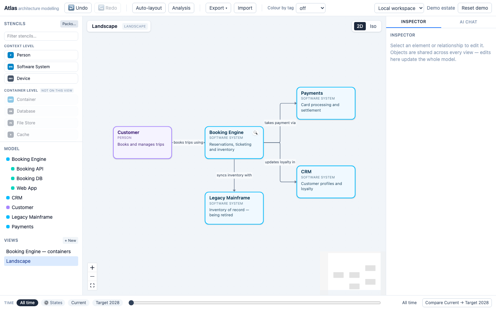
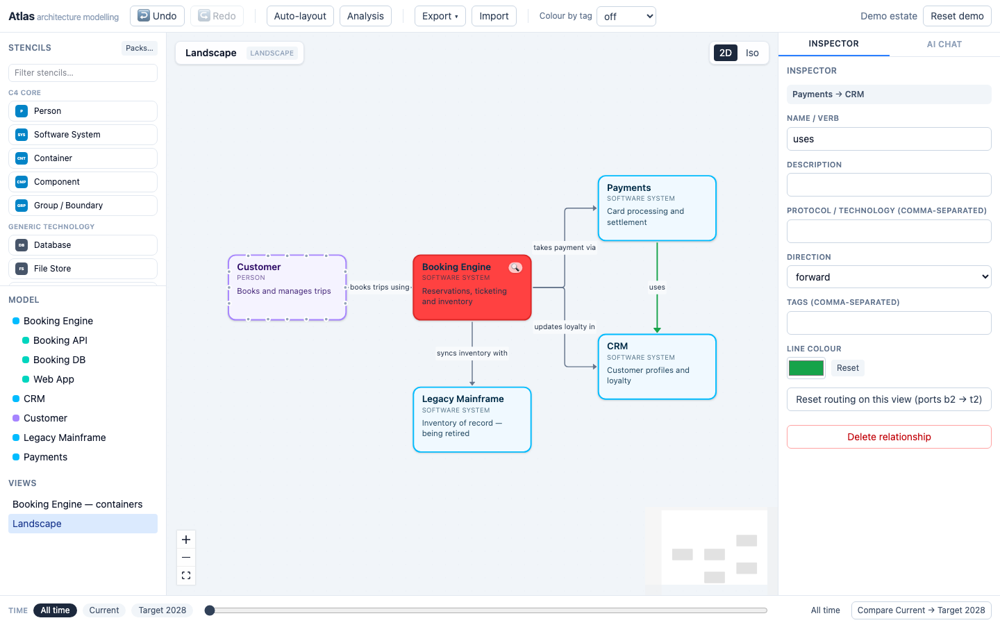
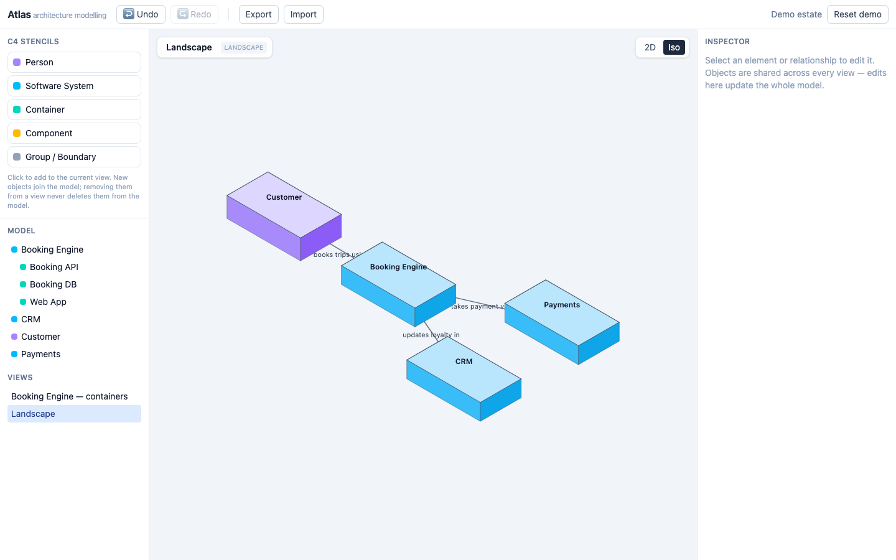
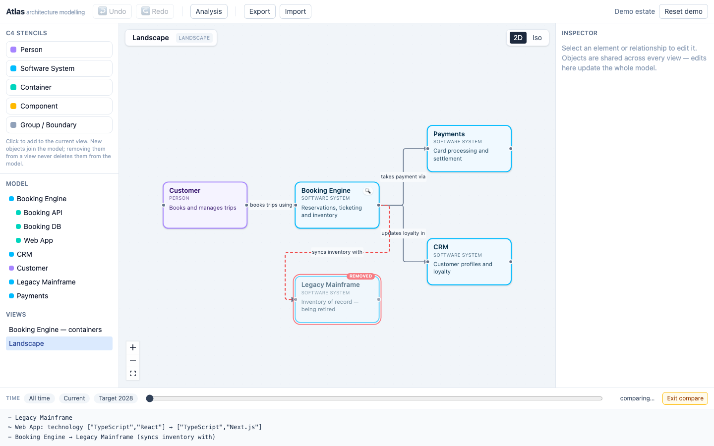
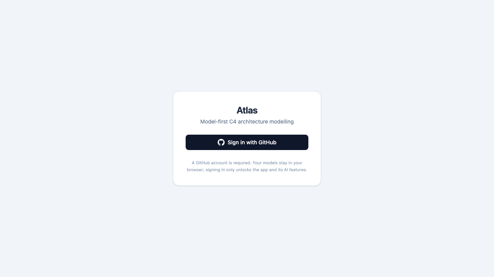

# Atlas user guide

Atlas is a browser-based, **model-first** C4 architecture modelling tool: you build one
shared model of your estate, and diagrams ("views") are projections of it, not separate
drawings. This guide walks through every feature of the hosted app at
[atlas-modelling.pages.dev](https://atlas-modelling.pages.dev) using a British Airways–flavoured
example estate — a **Booking Engine** system, its **Payments API** container, and a
**Fare Search** component — built on top of the demo data Atlas ships with.

Every claim in this guide is verified against the Atlas source code (`apps/web/src`,
`packages/core/src`, `packages/ai/src`) rather than assumed from general C4 knowledge —
where the tool's actual behaviour differs from what you might expect, that's called out
explicitly.

## Contents

1. [Getting started](#getting-started)
2. [The model is the source of truth](#the-model-is-the-source-of-truth)
3. [Element kinds and containment rules](#element-kinds-and-containment-rules)
4. [Views](#views)
5. [The palette](#the-palette)
6. [Canvas editing](#canvas-editing)
7. [Isometric mode](#isometric-mode)
8. [The Inspector](#the-inspector)
9. [Temporal modelling](#temporal-modelling)
10. [Cost modelling (TCO)](#cost-modelling-tco)
11. [Analysis: lint, dependency matrix, impact, connections](#analysis-lint-dependency-matrix-impact-connections)
12. [Undo, redo and the command bus](#undo-redo-and-the-command-bus)
13. [The AI assistant](#the-ai-assistant)
14. [Persistence: local vs shared database](#persistence-local-vs-shared-database)
15. [Signing in](#signing-in)
16. [The REST API](#the-rest-api)
17. [Export and import](#export-and-import)
18. [Keyboard shortcuts](#keyboard-shortcuts)

---

## Getting started

Open [atlas-modelling.pages.dev](https://atlas-modelling.pages.dev). On the hosted app you'll
land on a sign-in screen first — see [Signing in](#signing-in). Once past it, Atlas seeds a
**"Demo estate"** workspace on first run: a small airline landscape with a **Customer**,
a **Booking Engine** system (containing a **Web App**, **Booking API** and **Booking DB**),
**Payments**, **CRM** and a retiring **Legacy Mainframe**. This is exactly the estate used
throughout this guide.

To restore the demo estate at any point: click **Reset demo** at the right-hand end of the
toolbar, then confirm the dialog ("Replace the current workspace with the demo estate?").

A condensed version of this guide is also available inside the app: click **? Guide** in
the toolbar to open the user-guide panel, which includes a one-click **Load demo model**
button (available when the workspace is empty) that builds a small costed example estate
as a single undoable step.

The screen is laid out as:

- **Toolbar** across the top — undo/redo, auto-layout, analysis, export/import, tag colour
  overlay, persistence switcher, and sign-out.
- **Left sidebar** — the **Palette** (stencils) above the **Model** tree and **Views** list.
- **Centre** — the **Canvas**, with breadcrumbs top-left and the 2D/Iso toggle top-right.
- **Right sidebar** — tabs for the **Inspector** and **AI chat**.
- **Bottom bar** — the **Time** control (temporal scrubber, named states, diff/compare).



---

## The model is the source of truth

Atlas is built on one rule: **elements are model objects; diagrams are views onto them.**
A Booking Engine system, a Payments API container, a Fare Search component — each exists
exactly once in the model. A view is just a set of *placements* (an element id plus an x/y
position) plus a kind and an optional scope. The same element can appear on any number of
views, and editing it in one place (the Inspector) updates every view that shows it — the
Inspector's empty-state text says this outright: *"Objects are shared across every view —
edits here update the whole model."*

### The model tree

The left sidebar's **Model** section (heading `Model`) lists every element as a nested
tree, indented under its parent, sorted alphabetically at each level. Each row shows:

- a small coloured chip for its kind,
- the element's name,
- an orange **●** dot if the element isn't placed on *any* view yet (titled "Not on any
  view (orphan)"),
- a **+ place** button (visible on hover) if the element isn't on the *current* view but
  is legal there — clicking it places the element on the active view immediately.

Below it, the **Views** section lists every view, with **✎** (rename) and **✕** (delete)
buttons that appear on hover.

### Delete from a view vs delete from the model

This distinction matters and Atlas is deliberately explicit about it:

**To remove an element from just the current view** (it stays in the model and on every
other view): select it and either press **Delete** or **Backspace**, or click
**Remove from this view** in the Inspector. There's no confirmation dialog — this is a
low-stakes action by design.

**To delete an element from the model entirely** (removes it from every view and deletes
every relationship touching it): select it, open the Inspector, and click
**Delete from model…**. You'll get a confirmation dialog:

> Delete "Fare Search" from the model? This removes it from every view and deletes its
> relationships.

If the element still has children (e.g. you try to delete a system that still contains
containers), Atlas refuses with:

> "Booking Engine" still contains elements — delete or move them first.

**Deleting a view** is a third, separate action, reached via the **✕** next to the view's
name in the Views list. It only removes that diagram — the confirmation dialog reads
*"Delete view "Booking Engine — containers"? Elements stay in the model."* and its title
tooltip spells out the same thing: "Delete view (the model is untouched)".

---

## Element kinds and containment rules

Atlas has exactly five element kinds: **Person**, **Software System**, **Container**,
**Component** and **Group**. Every stencil — including every AWS/Azure/GCP service — maps
onto one of these five; packs never invent new kinds.

Containment is fixed and enforced everywhere (UI, AI, API, CLI) via one shared rule table:

| Kind | Legal parent(s) |
|---|---|
| Person | top level only |
| Software System | top level only |
| Container | inside a Software System |
| Component | inside a Container |
| Group | top level, inside a Software System, or inside a Container (groups are transparent boundaries, not containers in their own right) |

To build the worked example used later in this guide:

1. On the **Landscape** view, the **Payments** system already exists (from the demo
   estate).
2. Double-click **Payments** on the canvas to drill in — this creates (or reuses) a
   **container** view scoped to Payments.
3. Add a **Container** stencil from the palette and name it **Payments API**. Because
   you're on a view scoped to Payments, it's automatically parented under Payments.
4. Double-click **Payments API** to drill in again — this creates a **component** view
   scoped to it.
5. Add a **Component** stencil and name it **Fare Search**. It's automatically parented
   under Payments API.

If you try to break the rules, Atlas rejects the operation with a specific message. For
example, trying to place a Component directly under a Software System (skipping the
Container level) produces:

> A Component cannot live inside a Software System. Legal parents: Container.

Trying to put a Container under a Person fails the same way, because a Container's only
legal parent is a Software System. Moving an element inside its own descendant (a
containment cycle) is rejected with:

> Cannot move "Payments API" inside its own descendant.

Relationships can't use a Group as an endpoint — Groups are boundaries, not participants:

> Groups are boundaries, not systems — connect "Fare Search"'s members instead.

There is **no duplicate-name rejection** in the metamodel — two elements can legally
share a name (the Analysis drawer's lint check flags this as a *suggestion*, not a hard
error — see [Analysis](#analysis-lint-dependency-matrix-impact-connections)).

---

## Views

A view is a named diagram: a kind, an optional **scope** (the element it's zoomed into),
and a list of placements. Atlas has five view kinds:

| Kind | What it's for | Elements allowed on it |
|---|---|---|
| `landscape` | The whole estate at a glance | Person, Software System, Group |
| `context` | A single system in its context | Person, Software System, Group |
| `container` | Inside one system | Software System, Container, Group |
| `component` | Inside one container | Container, Component, Group |
| `custom` | Free-form, mixed-level canvas | Software System, Container, Group |

Two points worth being precise about, since they differ from a naive C4 assumption:

- **People are restricted to landscape and context views only** — you cannot place a
  Person stencil on a container, component, or custom view.
- **AWS/Azure/GCP service stencils are all Component kind**, so — like any Component —
  they're only placeable on component views. The exception is each cloud's network
  boundary stencil (AWS VPC, Azure VNet, GCP VPC Network), which is Group kind and, like
  any Group, can go on *any* view kind.
- There is **no separate "deployment" or "dynamic" view kind** in Atlas — the fifth kind
  is `custom`, a general-purpose canvas, not a specialised deployment diagram.

Placing an element that isn't legal for the current view kind is rejected, e.g.:

> A Person cannot appear on a Component view — use it on: Landscape, Context views.

### To create a new view

Click **+ New** next to the **Views** heading in the left sidebar, type a name in the
prompt (e.g. "Ops landscape"), and confirm. This always creates a `custom`-kind view with
no scope — you then add elements to it from the palette yourself.

### Drilling in (the other way to create a view)

Double-click a Software System or Container box on the canvas (or click a crumb in the
breadcrumb bar) to "drill in". If a view already scoped to that element exists, Atlas
reuses it; otherwise it creates one automatically:

- Drilling into a **Software System** creates a **container** view scoped to it, with its
  direct child containers auto-placed in a grid.
- Drilling into a **Container** creates a **component** view scoped to it, likewise
  auto-placing its child components.

### Scope

A view's **scope** is the element it's zoomed into — the system for a container view, the
container for a component view. Landscape and custom views have no scope (`null`). Scope
matters for editing: when you add a new Container/Component/Group from the palette while
on a scoped view, the new element is automatically parented under the view's scope
element. Person and System stencils always go to the top level regardless of scope.

To rename a view, click the **✎** next to it in the Views list and edit the prompt.

---

## The palette

The palette (left sidebar, headed **Stencils**) groups every stencil by C4 level, so it's
always obvious where something belongs:

| Section heading | Kinds | Tooltip |
|---|---|---|
| Context level | Person, Software System | "People and software systems — landscape and system-context views" |
| Container level | Container | "Apps and data stores inside a system — container views" |
| Component level | Component | "Building blocks inside a container, including all AWS/Azure/GCP services — component views" |
| Boundaries | Group | "Groups and network zones — usable on any view" |

### Placing a stencil

Placement is **click, not drag-and-drop**: click a stencil button and Atlas creates the
element and places it on the active view in one step, in the first free grid cell
(scanning left to right, top to bottom). To add a "Fare Search" component: while on the
Payments API component view, click **Component** (or a specific stencil from an enabled
pack) in the Component level section, then rename it via the Inspector.

### Disabled stencils

A stencil button is greyed out and disabled whenever its kind isn't legal on the current
view. Hovering a disabled button shows a tooltip such as:

> Person is not available on this component view — see the level heading for where it
> belongs

If an entire level has nothing usable on the current view, its heading gets a small
**"not on this view"** badge. A footer note under the palette reiterates the model-first
principle: *"Greyed stencils belong to a different diagram level — the heading says
where. Removing an object from a view never deletes it from the model."*

### Filtering and stencil packs

Use the **Filter stencils…** search box at the top of the palette to narrow a long list
down by name.

Stencils come from **stencil packs**, toggled via the **Packs…** button, which opens a
**Stencil packs** panel with a checkbox and stencil count per pack. The built-in packs are:

| Pack | Name | Contents |
|---|---|---|
| `c4-core` | C4 Core | Person, Software System, Container, Component, Group (5) |
| `generic-tech` | Generic Technology | Technology-agnostic building blocks (9) |
| `business` | Business | Business architecture concepts (7) |
| `aws` | Amazon Web Services | ~40 common AWS services (42) |
| `azure` | Microsoft Azure | ~40 common Azure services (39) |
| `gcp` | Google Cloud Platform | ~40 common GCP services (39) |

Disabling a pack never deletes elements built from it — they just fall back to a plain
symbol for their underlying kind. Built-in pack icons are generated glyphs (an
abbreviation on a coloured tile), not the providers' trademarked artwork.

---

## Canvas editing

### Dragging and alignment guides

Drag a box to reposition it. As you drag, Atlas compares its edges and centre against
every other box on the view and, when they line up within 2px, draws a dashed pink guide
line spanning both boxes so you can align things precisely. Boxes also snap to a 20px
grid as you drop them.

### Resizing

Atlas does not currently support drag-to-resize on the canvas. Every element gets a fixed
default footprint when placed — 180×100px (9×5 grid units) for people/systems/containers/
components, 360×240px (18×12 grid units) for groups. Non-default sizes can only be set via
an import or the REST API's placement `width`/`height` fields.

### Connecting boxes: the 16 ports

Every box exposes **16 connection ports**: five along the top, five along the bottom, and
three down each side. To draw a relationship, drag from any port on the source box to any
port on the target box and release — Atlas creates the relationship immediately and pins
the edge to exactly the ports you used.

### Straight-line auto-routing

If you don't manually pin a route, Atlas auto-routes based on box position: when two
boxes' centres line up in the same row or column (within 10px), the connection is drawn
as a single straight line between their facing middle ports. Otherwise it's drawn as an
orthogonal (stepped) line.

### Pinning a route to specific ports

Dragging a connection between two particular ports (rather than letting Atlas pick) pins
that relationship's route, on that view, to those exact ports. A pinned route only
renders as a straight line if the two chosen ports happen to be exactly in line with each
other; otherwise it's stepped.

### Reset routing

To clear a pinned route and go back to auto-routing: select the relationship and, in the
Inspector, click the button labelled (with the current pinned ports shown):

> Reset routing on this view (ports b2 → t2)

This button only appears when the selected relationship actually has a pinned route on
the current view.

### Box and line colours

Both are set from the Inspector, via a native colour swatch — there's no right-click menu:

- Selecting an element shows a **Box colour** swatch plus a **Reset to default** button
  once you've picked a custom colour. Each kind has a sensible default (e.g. systems are
  blue, containers teal, components amber).
- Selecting a relationship shows a **Line colour** swatch plus a **Reset** button.



### Hiding a relationship on a view

The underlying model and the REST API both support hiding a specific relationship on one
view without touching the model (`hiddenRelationshipIds` on the view) — a hidden
relationship still exists everywhere else and reappears if you unhide it. **This isn't
currently exposed as a button or menu in the app UI**; today it's only reachable by
patching a view through the REST API.

### The minimap

A minimap (bottom-right of the canvas) is always visible — it's React Flow's standard
pannable, zoomable minimap, not something you toggle on or off.

### Auto-layout

Click **Auto-layout** in the toolbar (tooltip: "Re-arrange the current view with ELK
(layered); one undo step") to have Atlas re-lay-out every box on the current view using
the ELK "layered" algorithm, left-to-right, with fixed spacing. There are no direction or
spacing options exposed — it's a single fixed configuration you run on demand, and the
whole re-layout is one undo step.

### Colour by tag

Not in the original brief, but present and useful: a **Colour by tag** dropdown at the
right of the toolbar (only shown once at least one element has a tag) highlights every
element sharing the chosen tag with a magenta ring, across the whole canvas — handy for
spotting everything tagged, say, `pci` or `legacy`.

---

## Isometric mode

To switch a view's rendering between flat 2D and an isometric projection: click the
**2D** / **Iso** buttons at the top-right of the canvas (`ModeToggle`). This is a render
mode stored on the view, not a separate diagram — the same view can be flipped back and
forth.

Isometric mode consumes **exactly the same placement coordinates** as the 2D canvas — the
same grid x/y, no separately maintained isometric layout — and projects them with a
classic 2:1 dimetric transform. Relationships are rendered too, as straight lines with
arrowheads and rotated labels, respecting any hidden-relationship settings.

Isometric mode is **read-mostly**: you can click boxes to select and inspect them, but you
can't drag, resize, or draw new connections while in Iso mode — those edits happen back
in 2D.



---

## The Inspector

Selecting an element or relationship opens its details in the right-hand **Inspector**
tab. Nothing here is duplicated per view — every field is on the shared model object.

### Element fields

| Field | Notes |
|---|---|
| Name | Plain text |
| Description | Short one-line summary shown on the canvas box |
| Documentation (Markdown) | A **Write**/**Preview** toggle over a long-form Markdown field, rendered with `react-markdown`; shows *"Nothing documented yet."* when empty |
| Status | `—`, Proposed, Planned, Live, Deprecated, Decommissioned |
| Criticality | `—`, Low, Medium, High, Critical |
| Technology (comma-separated) | Free-text tag list, e.g. `Kotlin, Spring Boot` |
| Tags (comma-separated) | Free-text tag list |
| Box colour | Colour swatch + Reset to default |
| Time (validity & states) | See [Temporal modelling](#temporal-modelling) |
| Costs | See [Cost modelling](#cost-modelling-tco) |
| Owners | Free-text (comma-separated) |
| Team | Free text |
| Links | A list of title/URL pairs, each with a "Remove link" (✕); Add is disabled until you enter a title and a URL starting `http(s)://` |
| Appears in | Read-only list of every view the element is placed on, each a clickable jump link; shows *"Not placed on any view yet."* for orphans |
| Connections view — all relationships | Opens the automated ego-network view (see [Analysis](#analysis-lint-dependency-matrix-impact-connections)); hidden for Groups |
| Remove from this view / Delete from model… | See [Delete from a view vs delete from the model](#delete-from-a-view-vs-delete-from-the-model) |

When the element is built from a stencil pack with an attribute schema (e.g. an AWS
Lambda), an extra section headed **"{stencil name} attributes"** appears with one text
field per pack-defined property (e.g. `accountId`, `region`, `runtime` for Lambda) —
these validate against the pack's JSON Schema the same way every other command does.

### Relationship fields

| Field | Notes |
|---|---|
| Name / verb | e.g. "takes payment via" |
| Description | Free text |
| Protocol / technology (comma-separated) | e.g. `HTTPS, REST` |
| Direction | Forward or Bidirectional |
| Tags (comma-separated) | Free text |
| Time (validity & states) | Same temporal editor as elements |
| Line colour | Colour swatch + Reset |
| Reset routing on this view | See [Canvas editing](#canvas-editing) |
| Delete relationship | Removes it from the model entirely |

---

## Temporal modelling

Atlas can model an estate's evolution over time, not just its current state, using two
mechanisms together.

### Validity dates

Any element or relationship can carry:

- **Valid from** — the date it enters the estate.
- **Valid to (retired after)** — the date it leaves.

Both are set in the Inspector's **"Time (validity & states)"** section. In the demo
estate, the Legacy Mainframe → Legacy inventory sync relationship has `validTo:
2027-12-31`, so it naturally disappears once you scrub the timeline past that date.

### Named states

A **named state** is a labelled snapshot in time (e.g. "Current" vs "Target 2028") that
you can flip between or diff against each other, independent of raw dates.

**To manage named states**: click **⚙ States** on the Time bar (tooltip: "Create, rename
or delete named states"). In the panel that opens:

- Click **+ Add state** to create one (named "New state", or "New state 2" etc. if that
  name's taken).
- Edit the name inline; it commits when you click away.
- Set a date per state with the date field next to it.
- Click **✕** to delete a state — you'll be asked to confirm: *"Delete state "Target
  2028"? Membership and overrides referencing it are removed (undoable)."*

**To put an element or relationship in a state**: in the Inspector's Time section, tick
the checkbox for that state under **"State membership (explicit membership overrides
dates)"**. Explicit membership always wins over date-based visibility when both are set.

### State overrides

An element can carry different attribute values (name, description, technology, status,
tags) *per named state* — a **state override**. In the demo estate, the Web App container
has a state override on the "Target 2028" state that changes its technology from
`["TypeScript", "React"]` to `["TypeScript", "Next.js"]` — so viewing that state shows the
Target-2028 tech stack without altering the Current-state record.

State overrides are fully supported by the model and the temporal engine, and Atlas
applies them automatically wherever a state context is active. **There's no dedicated
editor for authoring overrides directly in the current app UI** (the Inspector's state
checkboxes control *membership*, not per-state attribute values) — today they're set via
the REST API or scripted seeding, the same way the demo estate's own Web App override was
created.

### The timeline scrubber

The **Time** bar along the bottom of the app is a lens over every view:

- **All time** shows everything, ignoring dates and state membership.
- Click a **named-state chip** (e.g. "Current", "Target 2028") to view the estate exactly
  as that state defines it.
- Drag the **date range slider** to re-evaluate visibility at an arbitrary date — the
  label to its right shows the resulting context (a date, a state name, or "All time").
- A **run-rate chip** ("Run rate: £4.1M/yr") to the right of the slider shows the whole
  estate's annualised cost under whatever context is active, live as you scrub — see
  [Cost modelling](#cost-modelling-tco).

### Diff overlay and diff report

**To compare two named states**, click the button at the right of the Time bar — its
label is exactly:

> Compare Current → Target 2028

(It always compares your earliest-dated state against your latest-dated state; there's no
picker for arbitrary state pairs.) This switches the context to "All time" and turns on
compare mode, so the canvas shows both states' elements superimposed:

- Boxes only in the later state get an **emerald** ring and an **"added"** badge.
- Boxes only in the earlier state get a **red** ring, are faded, and get a **"removed"**
  badge.
- Boxes present in both but with different attributes get an **amber** ring and a
  **"changed"** badge.

Below the Time bar, a plain-text **diff report** lists every change line by line, e.g.:

```
- Legacy Mainframe
~ Web App: technology ["TypeScript","React"] → ["TypeScript","Next.js"]
- Booking Engine → Legacy Mainframe (syncs inventory with)
```

(`+` = added, `-` = removed, `~` = changed attribute.) Click **Exit compare** to leave
diff mode.



---

## Cost modelling (TCO)

Atlas attaches cost entries directly to elements and rolls them up through the model, so
you get total cost of ownership for free from the same containment hierarchy you already
built.

### Adding a cost entry

In the Inspector, expand the **Costs** section (click the **▸ Costs** header; it shows a
live summary like "3 entries · £12,000/yr" or "No costs"). Click **+ Add cost**, then fill
in:

| Field | Notes |
|---|---|
| Label | Required, e.g. "Enterprise licence" |
| Category | Licences, Infrastructure, People, Vendor services, Change, Decommission, Other |
| Classification | Run, Change, Acquire, Retire |
| Kind | Recurring or One-off |
| Confidence | `—`, Estimate, Quoted, Actual |
| Amount | Required, must be greater than zero |
| Currency | Free text, ISO 4217 (e.g. `GBP`); defaults to GBP if left blank |
| Period *(recurring only)* | Monthly or Annual |
| Amortise over (years) *(one-off only)* | Whole years, default 3 |
| Valid from / Valid to (retired after) | Same temporal semantics as elements |
| State membership | Tick which named states this cost applies to |

A new entry isn't saved until it's valid — Atlas starts you at amount `0`, which fails
validation (*"Amount must be greater than zero"*) until you fill it in.

### Worked example: Payments API licence + migration

Give the **Payments API** container two cost entries:

1. **SaaS licence** — Category: Licences, Classification: Run, Kind: Recurring, Amount:
   `42000`, Period: Annual, Confidence: Quoted.
2. **Migration project** — Category: Change, Classification: Change, Kind: One-off,
   Amount: `250000`, Amortise over: `3` years, Valid from: `2026-01-01`.

Atlas annualises each entry the same way: a recurring annual entry counts at face value;
a one-off entry is spread straight-line over its amortisation window
(`amount ÷ amortiseYears`). So while the migration's three-year amortisation window is
open, Payments API's combined annual run-rate is:

```
£42,000/yr (licence)  +  £250,000 ÷ 3 = £83,333.33/yr (migration)
= £125,333.33/yr  (≈ £125,333/yr)
```

### The Analysis drawer's TCO section

Open the **Analysis** drawer (toolbar button) and scroll to **"TCO (total cost of
ownership)"**. Here you can:

- Pick a **Horizon** — 1, 3, 5 or 10 years — to multiply the annual run-rate into a
  multi-year total cost figure.
- Toggle **Cost overlay** ("Tint canvas nodes by rolled-up annual cost") to tint every box
  on the canvas by its own rolled-up cost relative to the estate's most expensive element
  — this also adds a small pill badge in the bottom-right corner of each box (e.g.
  "£125k/yr") coloured amber below two-thirds of the estate maximum, red at or above it.
- Read the table, whose columns are literally **Element**, **Own £/yr**, **Rolled-up
  £/yr**, and **{n}-yr TCO**.

**Roll-up semantics**: a cost attached to a Component rolls up into its parent
Container's "Rolled-up £/yr", which rolls up into its parent System's — so Fare Search's
own costs contribute to Payments API's rolled-up total, which contributes to Payments'.
Attach a cost to the element that actually incurs it — never to both a child and its
parent, or it'll be counted twice at the parent level. (The estate-wide total shown above
the table always sums **own** costs once across every element, precisely to avoid that
double-count.)

### Exporting the TCO table

Click **Export CSV** (only shown once there's at least one cost entry) to download
`atlas-tco.csv`, with header row:

```
element,kind,own_annual,rolled_up_annual,tco_5yr
```

(the `tco_{n}yr` column name reflects whichever horizon you last selected).

### Cost deltas in the diff report

While comparing two named states (see [Temporal modelling](#temporal-modelling)), the
Time bar also shows a cost-delta block beneath the diff report, e.g.:

```
Annual: £125k → £98k (Δ -£27k)
5-yr TCO Δ: -£135k
```

Cost increases are shown in red, decreases in green (the 5-year window here is fixed,
independent of whatever horizon you've picked in the Analysis drawer).

---

## Analysis: lint, dependency matrix, impact, connections

Click **Analysis** in the toolbar to open the **Estate analysis** drawer (close it with
the **Close** button, top-right of the drawer).

### Consistency report (lint)

Atlas checks the whole model for three kinds of issue:

- **`orphan-element`** — `"Fare Search" is in the model but not on any view`
- **`duplicate-name`** — `2 elements named "Payments API" share the same scope`
- **`unplaced-relationship`** — `Relationship Payments API → CRM appears on no view`

If nothing's wrong, the section reads *"No issues — every element is placed and names are
unique in scope."* Otherwise each issue is a clickable chip; clicking it selects the first
implicated element so you can jump straight to it. There's no severity level — every issue
is styled identically.

### Dependency matrix

Headed **"Dependency matrix (top-level systems)"**, this is a grid of every top-level
system against every other: the header reads "from \ to", and cell `[row, column]` shows
the count of relationships from the row's system to the column's. Non-zero cells are
highlighted blue with the count; zero cells show a pale `·`.

### Impact analysis

Headed **"Impact — what is downstream of…"**. Pick an element from the dropdown (default:
"Choose an element…") and Atlas lists every element reachable by following outbound
relationships transitively — i.e. everything that would be affected if you changed or
retired the selected element. Clicking a result in the list selects it. If nothing's
downstream, it reads *"Nothing downstream."*

### Connections view

Not listed in the original feature set but present and useful: click **"Connections view
— all relationships"** in the Inspector for any selected element to open a full-screen,
automatically laid-out **ego-network** diagram centred on it — every relationship it
participates in, radiating outward by hop count. Controls at the top let you adjust:

- **Depth** — 1 to 4 hops.
- **Direction** — both / outgoing / incoming.
- **Tag** — restrict to relationships carrying a specific tag.

Click any node in this view to select it (and jump the main Inspector to it); click
**Close** to return to the canvas.

---

## Undo, redo and the command bus

Every mutation in Atlas — whatever triggers it — goes through one shared **command bus**.
The UI, the AI assistant, and the REST API all dispatch the same typed commands
(`createElement`, `updateElement`, `deleteElement`, `createRelationship`, `placeOnView`,
`batch`, …) against the same metamodel validation, so a rule violation produces the same
error message no matter which surface you used.

Dispatching a command computes and stores its exact inverse; undoing pops that inverse
back onto the model, and redoing re-applies the original. Multi-step operations (like
Auto-layout, or an AI proposal with several changes) are wrapped in a single `batch`
command, so they undo and redo as **one step**, not several.

**To undo**: click **↩ Undo** in the toolbar, or press **⌘Z** / **Ctrl+Z**.
**To redo**: click **↪ Redo**, or press **⇧⌘Z** / **Ctrl+Shift+Z**.

Both toolbar buttons are disabled automatically when there's nothing to undo/redo.

---

## The AI assistant

Switch to the **AI chat** tab in the right sidebar to open the assistant. It requires a
signed-in session (or a personal API key) — without one, the input placeholder reads *"Set
your API key first…"* and sending a message opens the settings prompt instead of
contacting the model.

### How it works

Describe what you want in plain language, for example:

> add a payments system connected to the booking engine over Kafka

Atlas doesn't apply anything immediately. Instead, once the assistant has a set of
changes ready, they appear as a **"Proposed changes ({n})"** card in the chat, listing
each change as a bullet (e.g. "Create system Fare Search Cache"). Two buttons let you
decide:

- **Apply** — dispatches the whole proposal as a single batch command. On success the
  assistant posts *"✅ Changes applied (one undo step)."*
- **Discard** — throws the proposal away with *"Proposal discarded — nothing was
  changed."*

Because the whole proposal is one `batch` command, applying it is a **single undo step**
— press ⌘Z once to reverse an entire AI turn, however many elements, relationships or cost
entries it touched.

### What the assistant can do

The assistant's tools map directly onto model operations:

- **Query the model** (read-only lookups).
- **Create elements** — any of the five kinds.
- **Update elements** — rename, redescribe, retag, change technology/status/team/colour,
  or move to a new parent.
- **Create relationships** between named elements, with a verb phrase, technology and
  tags.
- **Create a view** of any of the five kinds.
- **Place existing elements on a view** (defaults to the view you're currently looking
  at).
- **Set costs** — the full cost-entry shape described in
  [Cost modelling](#cost-modelling-tco): category, classification, kind, amount,
  currency, period, amortisation, confidence, and temporal scope.
- **Set temporal state** — validity dates and/or named-state membership.

---

## Persistence: local vs shared database

Atlas can keep your workspace in two different places, switched from a dropdown at the
right of the toolbar (tooltip: "Where this workspace lives"):

- **Local workspace** *(default)* — the workspace lives entirely in your browser's
  `localStorage`, under the key `atlas.workspace.v1`. Nothing leaves your machine; nothing
  is shared with anyone else who opens the app.
- **Shared database** — the workspace lives in Atlas's Supabase-backed store and every
  signed-in user pointed at the same deployment sees (and can edit) the same estate.

**To switch to shared mode**: choose **Shared database** in that dropdown. A **Sync**
button (tooltip: "Pull the latest database state") appears next to it whenever you're in
this mode, letting you force an immediate refresh.

In shared mode, every command you dispatch (including undo/redo) is pushed to the server
individually, in dispatch order, so nothing you do is lost even if the connection is
momentarily flaky. Separately, Atlas **polls the server roughly every 8 seconds** (paused
while the browser tab isn't visible) and pulls down the latest full workspace snapshot —
so changes made by someone else, or via the REST API, appear in your open tab within a
few seconds without a manual refresh.

---

## Signing in

The hosted app at atlas-modelling.pages.dev requires **GitHub SSO** before you can use it
at all (this gate only applies to the production build — local development runs open).
You'll see:



Click **Sign in with GitHub** and authorise the app. As the small print under the button
says: *"A GitHub account is required. Your models stay in your browser; signing in only
unlocks the app and its AI features."* In other words, signing in doesn't by itself put
you into the shared database — it just unlocks the app and the AI assistant; you still
choose Local vs Shared explicitly (see above).

Optionally, whoever runs the deployment can restrict *write* access to a specific list of
GitHub usernames (an environment variable holding a comma-separated allow-list, enforced
by the server on every API and AI-proxy call). If your account isn't on that list and one
is configured, write attempts fail with *"This GitHub account is not authorised for the
Atlas workspace."* When no allow-list is configured, any signed-in GitHub account can
write to the shared workspace.

Once signed in, a **Sign out (yourname)** button appears at the top-right of the toolbar.

---

## The REST API

Atlas exposes the entire model over a REST API at `https://atlas-modelling.pages.dev/api/v1`,
authenticated with `Authorization: Bearer <token>` (either your GitHub session token or a
service token). It mirrors the app exactly — every mutation runs through the same command
bus as the UI and the AI assistant, so the same metamodel rules and the same
human-readable error messages apply. It supports elements, relationships, views and
placements, named states, cost entries, and a raw `POST /commands` endpoint for atomic
multi-step batches, plus convenience name-based lookups (`parentName`, `sourceName`, …)
for scripting. Full reference and worked `curl` examples: [`docs/api.md`](api.md). An
interactive Swagger UI — with "Try it out" support — is published at
[`/api/docs`](https://atlas-modelling.pages.dev/api/docs), backed by the machine-readable
spec at [`/api/v1/openapi.json`](https://atlas-modelling.pages.dev/api/v1/openapi.json).

---

## Export and import

### Export

Click **Export ▾** in the toolbar for a menu with five options, each downloading the
*current view* (except the first, which downloads the whole model):

| Menu item | File | Format |
|---|---|---|
| Workspace bundle (.json) | `{workspace-name}.atlas.json` | The whole model, Atlas's own JSON bundle format |
| Current view as SVG | `{view-name}.svg` | Vector image of the current view |
| Current view as PNG | `{view-name}.png` | Rasterised (2×) from the SVG, client-side |
| Current view as Mermaid C4 | `{view-name}.mmd` | Mermaid C4 diagram source |
| Current view as PlantUML C4 | `{view-name}.puml` | PlantUML C4 diagram source |

There is no zip export — every format above is a single JSON/SVG/PNG/text file.

### Import

Click **Import** to open a file picker accepting `.json` or `.xml`. Atlas auto-detects
the format:

- A `.xml` file is treated as an **ArchiMate Open Exchange** file (best-effort import).
- JSON with a `files` key is treated as an **Atlas workspace bundle**.
- JSON with a `model` key is treated as **Structurizr JSON** (best-effort import).
- Anything else is rejected with *"Unrecognised file — expected an Atlas bundle,
  Structurizr JSON, or ArchiMate XML"*.

Importing **replaces the current workspace** — there's no merge step, so export or note
down anything you want to keep first.

---

## Keyboard shortcuts

| Shortcut | Action | Notes |
|---|---|---|
| **⌘Z** / **Ctrl+Z** | Undo | Toolbar tooltip shows "Undo (⌘Z)" regardless of platform |
| **⇧⌘Z** / **Ctrl+Shift+Z** | Redo | Toolbar tooltip shows "Redo (⇧⌘Z)" |
| **Escape** | Deselect the current element or relationship | |
| **Delete** / **Backspace** | Remove the selected element from the current view (never the model), or delete the selected relationship from the model | |
| **Enter** (chat input) | Send the current message in the AI chat panel | Shift+Enter inserts a newline instead |
| **Enter** (Inspector text field) | Commit the field (blurs the input) | |

Shortcuts are suppressed while focus is inside a text input, textarea, or any editable
field, so typing "z" in a name field never triggers undo. Atlas treats **Ctrl** and
**Cmd** as equivalent for undo/redo — it doesn't detect your OS to change which one is
required, only which symbol it prints in tooltips.

---

*This guide was written against the Atlas source in this repository. If a button label,
field name, or behaviour above stops matching what you see in the app, the code has moved
on — check the component named alongside each feature (`Toolbar.tsx`, `Palette.tsx`,
`Canvas.tsx`, `Inspector.tsx`, `CostsEditor.tsx`, `TimelineBar.tsx`, `AnalysisDrawer.tsx`,
`ChatPanel.tsx`) for the current truth.*
